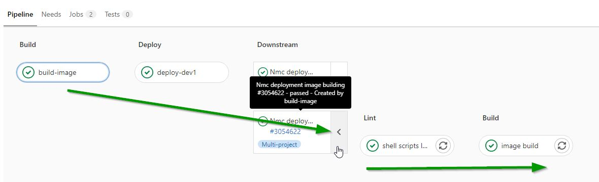
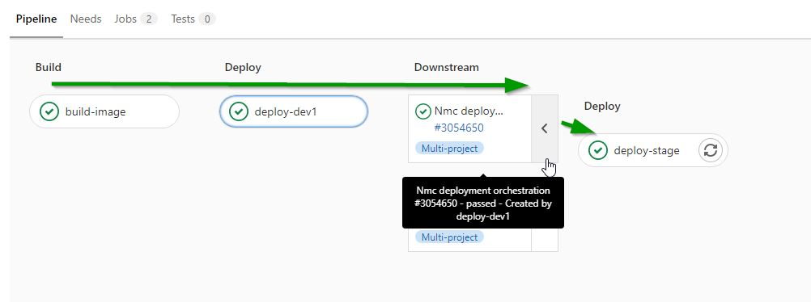
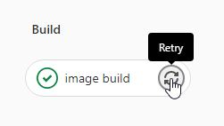
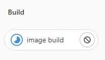
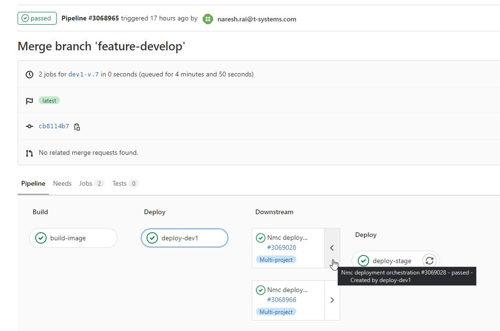
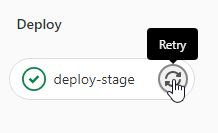
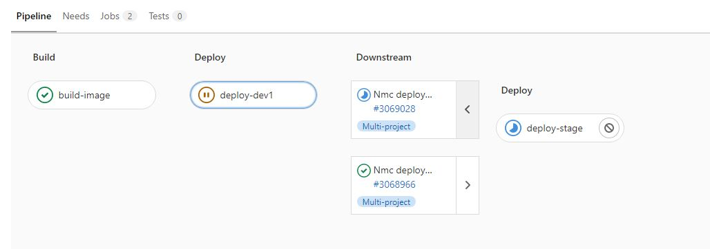

# Table of Contents
[[_TOC_]]
# Deploy new image into Dev1 environment

## 1. Go to the "Nmc custom theming" project in Gitlab

URL: https://gitlab.devops.telekom.de/nextmagentacloud/themes

### If needed change the app tags in pipeline cicd

In the file [.gitlab-ci.yaml](../.gitlab-ci.yaml) there are two sections.
One for **dev1** -> *build-image-dev1* section and one for **dev2** -> *build-image-dev2* section.

It is possible to change the values of the following variables:

* PKR_VAR_APP_FILES_VIDEOPLAYER_TAG
* PKR_VAR_APP_FILES_ZIP_TAG
* PKR_VAR_APP_FILES_DOWNLOADLIMIT_TAG
* PKR_VAR_APP_MONTHLY_STATUS_EMAIL_TAG
* PKR_VAR_APP_END_TO_END_ENCRYPTION_TAG
* PKR_VAR_APP_PHOTOS_TAG
* PKR_VAR_APP_TEXT_TAG
* PKR_VAR_APP_NMC_FIRSTRUNWIZARD_TAG
* PKR_VAR_APP_NMC_FILES_ACTIVITY_TAG
* PKR_VAR_APP_ACTIVITY_TAG
* PKR_VAR_APP_NMC_SHARING_TAG
* PKR_VAR_APP_NMC_WELCOME_POPUP_TAG
* PKR_VAR_APP_NMC_EMAIL_TEMPLATE_TAG
* PKR_VAR_APP_QUOTA_WARNING_TAG
* PKR_VAR_NC_VERSION 
  * for **Nextcloud** version **22** you have to use **22.2.0**
  * for **Nextcloud** version **23** you have to use **23.0.6**
* PKR_VAR_NC_TAG

Nothing else should be touched.

## 2. Tag the code

1. Go to the *Repository* menu and click on *Tags*

1. Click on *New tag*

1. Fill in the *Tag name* with the name of the tag. The string have to start with 
  * `dev1-` - for deployment to **dev1**
  * `dev2-` - for deployment to **dev2**
  * *Create from*: `master`
  *  *Message*: Here add some comment to the tag

4. Click on *Create tag*

Now the pipeline **starts automatically** to 
1. Create a new image from the tagged code
2. Deploy the new image to dev1

# How to check the status of the pipeline

## 1. Go to the "Nmc custom theming" project in Gitlab

URL: https://gitlab.devops.telekom.de/nextmagentacloud/themes

## 2. Search for the pipeline

1. Go to the *CI/CD* menu and click on *Pipelines*

1. In the page of pipelines you will see
    * the name of the *Tag* under **Commit**
    * the Pipeline ID
    * and the status of the Jobs for each stage under **Stages**. Here if everything is green then the pipeline finished without error and the new image is deployed successfuly into dev1

  Click on the pipeline ID to get inside the pipeline.

## 3. Check the status of the pipeline

1. Inside the pipeline you will see
  * the name of the **Tag**
  * **build-image** is the job to create a new image from the code
  * **deploy-dev1** is the job to deploy the new image to dev1 environment

  * If you see a **green checkmark** for the particular job then it means the job finished successufuly
  * If you see a **pause** sign then it means the job is not jet started
  * If you see a **play** sign then it means the job runs
  * If you see a **red X** sign then it means the job failed
4. This is the pipeline flow for the image building process. To see the **Lint** and **Build** job you have to click on the **Downstream** job indicated below

4. This is the pipeline flow for the image building process. To see the **Deploy** job you have to click on the **Downstream** job indicated below

This will be important also for a rollback process.

# How to rollback
## 1. Go to the "Nmc custom theming" project in Gitlab

URL: https://gitlab.devops.telekom.de/nextmagentacloud/themes

## 2. Search for the pipeline

1. Go to the *CI/CD* menu and click on *Pipelines*

1. In the page of pipelines you will see
    * the name of the *Tag* under **Commit**
    * the Pipeline ID
    * and the status of the Jobs for each stage under **Stages**. Here if everything is green then the pipeline finished without error and the new image is deployed successfuly into dev1

  Search for the version you would like to deploy by the name of the Tag.
  Click on the **Pipeline ID** to get inside the pipeline.
1. Inside the pipeline you will see
  * the name of the **Tag**
  * **build-image** is the job to create a new image from the code
  * **deploy-dev1** is the job to deploy the new image to dev1 environment

## 3. Rebuild the image

1. You have to click on the **Downstream** job indicated for *image building* below

1. Click on the icon with the arrows right to the **image build** job

1. The icon will switch to 
1. Wait until you see the green checkmark again

The Image building is done.

## 4. Redeploy the image

1. You have to click on the **Downstream** job indicated for *deployment orchestration* below

1. Click on the icon with the arrows right to the **deploy-stage** job

1. The icon will switch to 
1. Wait until you see the green checkmark again

The Image deployment is done.
