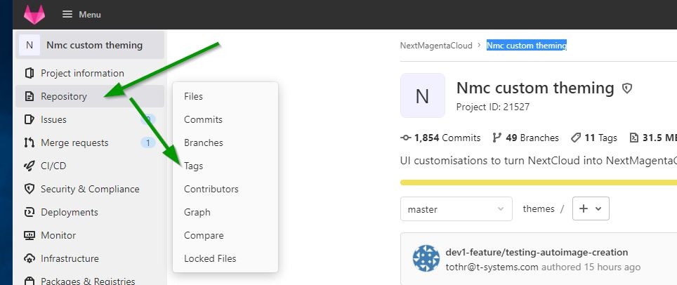
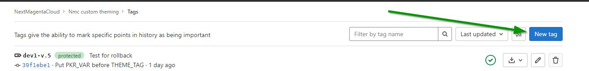
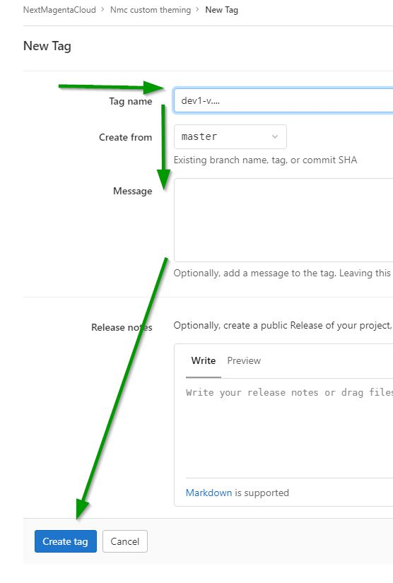
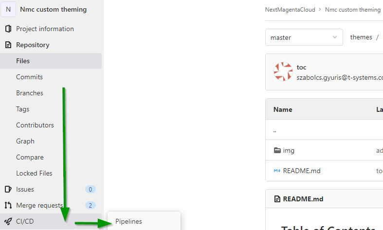
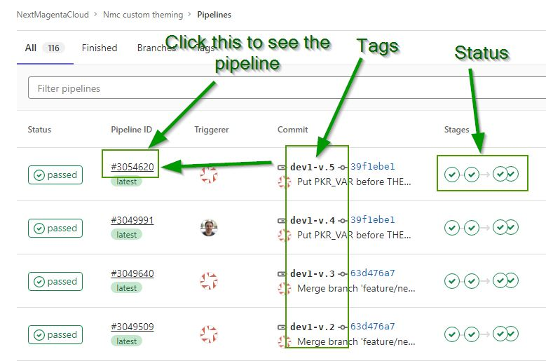
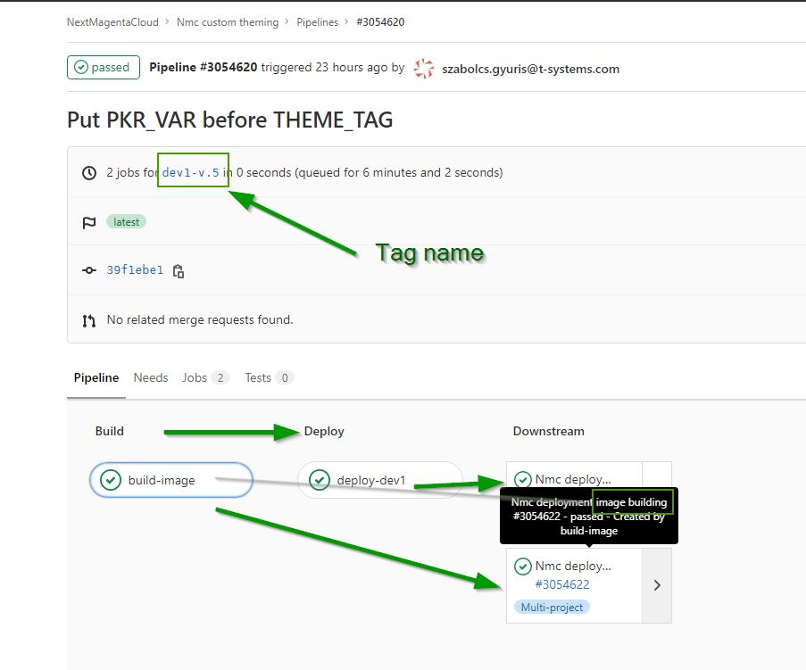

# Table of Contents
[[_TOC_]]
# Deploy new image into Dev1 environment

## Go to the "Nmc custom theming" project in Gitlab

URL: https://gitlab.devops.telekom.de/nextmagentacloud/themes

## Tag the code

1. Go to the *Repository* menu and click on *Tags*

1. Click on *New tag*

1. Fill in the *Tag name* with the name of the tag. The string have to start with `dev1-`
  * *Create from*: `master`
  *  *Message*: Here add some comment to the tag

4. Click on *Create tag*

Now the pipeline **starts automatically** to 
1. Create a new image from the tagged code
2. Deploy the new image to dev1

# How to check the status of the pipeline

## Go to the "Nmc custom theming" project in Gitlab

URL: https://gitlab.devops.telekom.de/nextmagentacloud/themes

## Search for the pipeline

1. Go to the *CI/CD* menu and click on *Pipelines*

1. In the page of pipelines you will see
    * the name of the *Tag* under **Commit**
    * the Pipeline ID
    * and the status of the Jobs for each stage under **Stages**. Here if everything is green then the pipeline finished without error and the new image is deployed successfuly into dev1

  Click on the pipeline ID to get inside the pipeline.
1. Inside the pipeline you will see
  * the name of the **Tag**
  * **build-image** is the job to create a new image from the code
  * **deploy-dev1** is the job to deploy the new image to dev1 environment

  * If you see a **green checkmark** for the particular job then it means the job finished successufuly
  * If you see a **pause** sign then it means the job is not jet started
  * If you see a **play** sign then it means the job runs
  * If you see a **red X** sign then it means the job failed
  